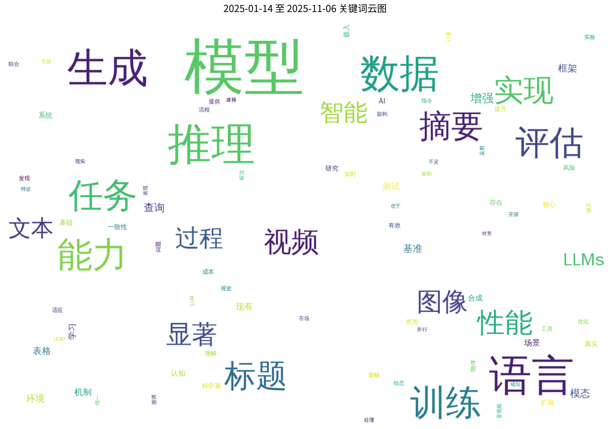
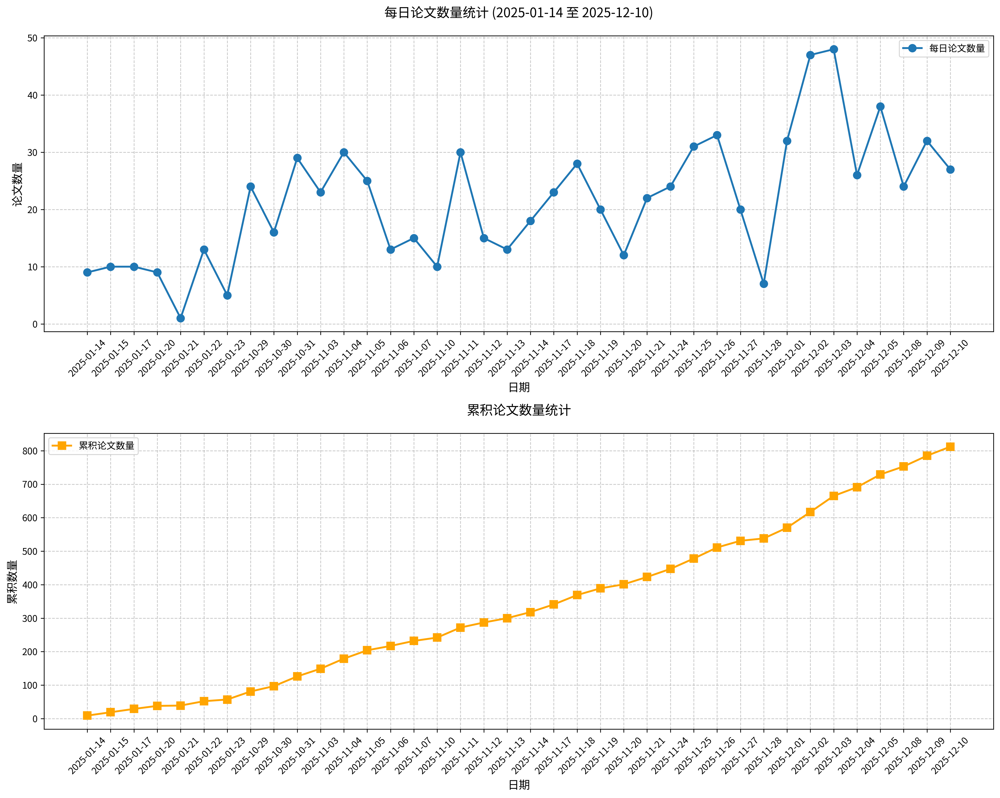

#  Hugging Face 2025-11-13 论文日报

## 📊 今日论文统计
- 总论文数：13
- 热门领域：LLM

## 📝 论文详情

### 1. Lumine：构建3D开放世界通用智能体的开放方案

**原文标题：** Lumine: An Open Recipe for Building Generalist Agents in 3D Open Worlds

**摘要：**
本文提出Lumine——首个用于开发通用智能体的开放方案，该方案能在具有挑战性的3D开放世界环境中实时完成长达数小时的复杂任务。Lumine采用类人交互范式，通过视觉语言模型驱动，以端到端方式统一感知、推理与行动。该系统以5赫兹频率处理原始像素数据，生成精确的30赫兹键鼠操作，并仅在必要时自适应触发推理机制。通过在《原神》中的训练，Lumine成功以媲美人类水平的效率完成了长达五小时的蒙德城主线剧情，并能依据自然语言指令在3D开放世界探索与2D图形界面操作中执行采集、战斗、解谜及NPC交互等多样化任务。除领域内优异表现外，Lumine还展现出强大的零样本跨游戏泛化能力：未经微调即成功完成《鸣潮》中100分钟的任务流程与《崩坏：星穹铁道》首章五小时的全部内容。这些突破性成果彰显了Lumine在不同世界架构与交互机制下的卓越适应性，标志着开放环境下通用智能体研究迈出了实质性步伐。

**论文链接：** [HuggingFace](https://huggingface.co/papers/2511.08892) | [arXiv](https://arxiv.org/abs/2511.08892)

---

### 2. MADD：多智能体药物发现协同系统

**原文标题：** MADD: Multi-Agent Drug Discovery Orchestra

**摘要：**
先导化合物识别是早期药物研发的核心挑战，传统方法需要投入大量实验资源。人工智能技术的最新进展，特别是大语言模型的应用，实现了可降低成本和提升效率的虚拟筛选方法。然而，这些工具日益增长的复杂性限制了湿实验室研究人员的使用。多智能体系统通过结合大语言模型的可解释性与专业模型工具的精确性，提供了具有前景的解决方案。本研究提出MADD——一个能够根据自然语言查询构建并执行定制化先导化合物识别流程的多智能体系统。该系统通过四个协同工作的智能体来处理从头化合物生成与筛选中的关键子任务。我们在七个药物研发案例中对MADD进行评估，结果表明其性能优于现有基于大语言模型的解决方案。借助MADD，我们率先将人工智能优先的药物设计方法应用于五个生物靶点，并公布了所识别的先导化合物分子。最后，我们构建了包含三百余万种化合物的查询-分子对与对接评分新基准，以推动药物设计向智能体化方向发展。

**论文链接：** [HuggingFace](https://huggingface.co/papers/2511.08217) | [arXiv](https://arxiv.org/abs/2511.08217)

---

### 3. 时序运动：基于双时钟去噪的无训练运动控制视频生成方法

**原文标题：** Time-to-Move: Training-Free Motion Controlled Video Generation via Dual-Clock Denoising

**摘要：**
基于扩散模型的视频生成技术能够创建逼真的视频内容，然而现有基于图像和文本的条件控制方法无法实现精确的运动控制。先前基于运动条件合成的方案通常需要进行模型特定微调，这种方法计算成本高昂且具有局限性。我们提出时序运动（TTM）——一种无需训练、即插即用的视频生成框架，通过图像到视频（I2V）扩散模型实现运动与外观的联合控制。我们的核心思路是利用通过用户友好操作（如剪切拖拽或基于深度的重投影）获取的粗略参考动画。受SDEdit在图像编辑中使用粗粒度布局线索的启发，我们将粗略动画视为初始运动线索，并将该机制适配至视频领域。通过图像条件保持外观一致性，并创新性地提出双时钟去噪策略——这种区域依赖方法在运动指定区域强制实现强对齐，同时在其余区域保持灵活性，有效平衡用户意图忠实度与自然动态表现。这种轻量级的采样过程修改无需额外训练或运行时成本，且兼容任何骨干网络。在物体运动和相机运动基准上的大量实验表明，TTM在真实感和运动控制方面达到或超越了现有基于训练的基线方法。此外，TTM还引入了独特能力：通过像素级条件实现精确外观控制，突破了纯文本提示的局限性。请访问我们的项目页面查看视频示例和代码：https://time-to-move.github.io/。

**论文链接：** [HuggingFace](https://huggingface.co/papers/2511.08633) | [arXiv](https://arxiv.org/abs/2511.08633)

---

### 4. TiDAR：扩散式思考，自回归式表达

**原文标题：** TiDAR: Think in Diffusion, Talk in Autoregression

**摘要：**
扩散语言模型具备快速并行生成的潜力，而自回归模型因其因果结构与语言建模天然契合，通常在生成质量上表现更优。这引发了一个根本性问题：能否在保持自回归级质量的同时，实现高吞吐量、更高GPU利用率的协同效应？现有方法未能有效平衡这两个方面：要么采用较弱模型进行顺序草稿生成的推测解码技术偏重自回归特性导致起草效率低下，要么在扩散模型中采用某种左至右（类自回归）解码逻辑，仍存在质量下降问题且丧失并行化潜力。我们提出TiDAR——一种序列级混合架构，通过特殊设计的结构化注意力掩码在单次前向传播中实现扩散式令牌起草（思考）与自回归最终输出采样（表达）。该设计充分利用空闲GPU计算密度，在起草与验证能力间达成强力平衡。此外，TiDAR作为独立模型具备服务友好特性（低开销）。我们在15亿和80亿参数规模上，针对生成与似然任务对TiDAR、自回归模型、推测解码及扩散变体进行了全面评估。得益于并行起草采样机制及精确KV缓存支持，TiDAR在实测吞吐量上超越推测解码，在效率与质量上均优于Dream、Llada等扩散模型。最显著的是，TiDAR成为首个在质量上追平自回归模型的同时，实现每秒生成令牌数提升4.71至5.91倍的架构。

**论文链接：** [HuggingFace](https://huggingface.co/papers/2511.08923) | [arXiv](https://arxiv.org/abs/2511.08923)

---

### 5. LoopTool：构建数据与训练闭环以增强大语言模型工具调用鲁棒性

**原文标题：** LoopTool: Closing the Data-Training Loop for Robust LLM Tool Calls

**摘要：**
通过外部工具增强大语言模型（LLMs）使其能够执行复杂的多步骤任务。然而当前工具学习受限于静态合成数据流程——数据生成与模型训练被割裂为两个独立且无交互的环节。这种方式既无法自适应聚焦于模型的特定弱点，又放任噪声标签持续存在，从而降低训练效率。我们提出LoopTool，一个全自动、模型感知的数据演化框架，通过紧密集成数据合成与模型训练构建完整闭环。该框架通过三个协同模块迭代优化数据与模型：（1）贪婪能力探测（GCP）诊断模型已掌握与失败的能力项；（2）判据引导的标签验证（JGLV）使用开源评判模型发现并修正标注错误，逐步净化数据集；（3）错误驱动数据扩展（EDDE）基于已识别失败生成具有挑战性的新样本。这种闭环流程在成本可控的开源生态中运行，摆脱对昂贵闭源API的依赖。实验表明，采用LoopTool训练的8B模型显著超越其32B数据生成器，并在BFCL-v3和ACEBench基准测试中达到同规模模型的最优性能。我们的研究证明，闭环自优化的数据流程能显著提升大语言模型的工具使用能力。

**论文链接：** [HuggingFace](https://huggingface.co/papers/2511.09148) | [arXiv](https://arxiv.org/abs/2511.09148)

---

### 6. WMPO：基于世界模型的视觉-语言-动作策略优化方法

**原文标题：** WMPO: World Model-based Policy Optimization for Vision-Language-Action Models

**摘要：**
视觉-语言-动作模型在通用机器人操作任务中展现出巨大潜力，但其对专家示范数据的依赖限制了从失败中学习与自主纠错的能力。强化学习虽能通过与物理环境的自主交互实现自我改进，但在真实机器人上面临样本效率低下的问题。本文提出基于世界模型的策略优化框架WMPO，该原理性框架可在不与真实环境交互的情况下实现同策略视觉-语言-动作强化学习。与广泛使用的潜空间世界模型不同，WMPO专注于像素级预测，使虚拟轨迹与基于网络规模图像预训练的视觉-语言-动作特征保持对齐。关键的是，WMPO使策略能够执行同策略GRPO优化，其性能显著优于常用的异策略方法。在仿真与真实机器人环境中的大量实验表明，WMPO具有以下优势：（i）显著提升样本效率；（ii）获得更优的整体性能；（iii）展现出自主纠错等涌现行为；（iv）表现出强大的泛化能力与持续学习特性。

**论文链接：** [HuggingFace](https://huggingface.co/papers/2511.09515) | [arXiv](https://arxiv.org/abs/2511.09515)

---

### 7. MathSE：通过自演进迭代反思与奖励引导微调提升多模态数学推理能力

**原文标题：** MathSE: Improving Multimodal Mathematical Reasoning via Self-Evolving Iterative Reflection and Reward-Guided Fine-Tuning

**摘要：**
多模态大语言模型在视觉语言问答任务中展现出卓越能力。然而在处理数学问题求解等复杂推理任务时，这些模型仍面临显著挑战。现有研究主要集中于对专业数学数据集进行微调，但这些数据集通常直接从教师模型提取，仅能捕捉静态推理模式，且与学生模型存在显著差距。这种依赖固定教师衍生数据集的范式不仅限制了模型适应超越训练数据范围的新颖复杂问题的能力，更缺乏实现强泛化所需的迭代深度。为突破这些局限，我们提出MathSE——面向多模态大语言模型的数学自演进框架。与传统单次微调范式不同，MathSE通过推理、反思和奖励反馈的循环迭代优化模型。具体而言，我们通过整合前阶段推理产生的正确解题路径，并融合专业结果奖励模型的反思信号，实现迭代式微调。为验证MathSE的有效性，我们在系列挑战性基准测试上进行评估，结果表明其相较基线模型取得显著性能提升。值得注意的是，在MathVL-test数据集上的实验结果超越了当前领先的开源多模态数学推理模型QVQ。代码与模型已发布于https://zheny2751-dotcom.github.io/MathSE.github.io/。

**论文链接：** [HuggingFace](https://huggingface.co/papers/2511.06805) | [arXiv](https://arxiv.org/abs/2511.06805)

---

### 8. WebVIA：基于Web的视觉语言智能体框架——支持交互式可验证的界面到代码生成

**原文标题：** WebVIA: A Web-based Vision-Language Agentic Framework for Interactive and Verifiable UI-to-Code Generation

**摘要：**
用户界面开发需要将设计稿转换为功能代码，这一过程仍存在重复性强、劳动密集的问题。尽管当前视觉语言模型能够自动实现界面到代码的转换，但仅能生成缺乏交互功能的静态HTML/CSS/JavaScript布局。为此，我们提出WebVIA——首个支持交互式界面代码生成与验证的智能体框架。该框架包含三大核心模块：1）探索智能体负责捕获多状态界面截图；2）UI2Code模型生成可执行的交互式代码；3）验证模块确保交互功能的有效性。实验表明，WebVIA智能体相比通用智能体在界面探索任务中具有更稳定的表现和更高的准确率。此外，经微调的WebVIA-UI2Code模型在生成可执行交互代码方面取得显著提升，在交互式和静态界面代码生成基准测试中均优于基础模型。相关代码与模型已发布于https://zheny2751-dotcom.github.io/webvia.github.io/{https://webvia.github.io}。

**论文链接：** [HuggingFace](https://huggingface.co/papers/2511.06251) | [arXiv](https://arxiv.org/abs/2511.06251)

---

### 9. 迈向可靠扩散采样的前沿：基于对抗性Sinkhorn注意力引导的研究

**原文标题：** Toward the Frontiers of Reliable Diffusion Sampling via Adversarial Sinkhorn Attention Guidance

**摘要：**
扩散模型在使用分类器无关引导等方法时展现出强大的生成性能，这类方法通过修改采样轨迹来提升输出质量。现有方法通常采用启发式扰动函数（如恒等混合或模糊条件）刻意劣化无条件输出来增强目标输出，但缺乏理论依据且依赖人工设计的失真策略。本研究提出对抗性Sinkhorn注意力引导方法，通过最优传输理论重新诠释扩散模型中的注意力机制，并利用Sinkhorn算法主动干扰传输成本。该方法并非简单破坏注意力机制，而是在自注意力层中注入对抗性成本以降低查询向量与键向量的像素级相似度。这种定向劣化策略能有效削弱误导性注意力对齐，从而提升条件与非条件样本的生成质量。实验表明，ASAG在文生图任务中取得稳定改进，并在IP-Adapter、ControlNet等下游应用中增强了可控性与保真度。该方法具有轻量化、即插即用特性，无需重新训练模型即可提升生成可靠性。

**论文链接：** [HuggingFace](https://huggingface.co/papers/2511.07499) | [arXiv](https://arxiv.org/abs/2511.07499)

---

### 10. 基于合成监督的网页智能体自适应方法

**原文标题：** Adapting Web Agents with Synthetic Supervision

**摘要：**
由于特定环境任务及示范数据的稀缺，网页智能体在新网站上的适应能力面临挑战。现有研究尝试通过合成数据生成应对这一问题，但存在数据质量缺陷：合成任务常包含无法执行的幻象内容，采集的行为轨迹则存在冗余或错位等噪声。本文提出SynthAgent——一种通过任务与轨迹双重优化的全合成监督框架。该方法首先通过对网页元素进行分类型探索来生成多样化任务，确保对目标环境的高效覆盖。在轨迹采集过程中，当检测到任务与实际观察存在冲突时，我们会对任务进行实时优化，在保持任务一致性的同时消除幻象。采集完成后，我们基于全局上下文对轨迹进行精细化处理以消除潜在噪声与错位。最终，我们利用优化后的合成数据对开源网页智能体进行微调，使其适应目标环境。实验结果表明，SynthAgent在性能上超越现有合成数据方法，验证了高质量合成监督的重要性。代码将发布于https://github.com/aiming-lab/SynthAgent。

**论文链接：** [HuggingFace](https://huggingface.co/papers/2511.06101) | [arXiv](https://arxiv.org/abs/2511.06101)

---

### 11. 智能体驱动重构：AI编程智能体的实证研究

**原文标题：** Agentic Refactoring: An Empirical Study of AI Coding Agents

**摘要：**
以OpenAI Codex、Claude Code和Cursor为代表的智能编程工具正在重塑软件工程领域。这些AI驱动的系统作为自主协作伙伴，能够规划并执行复杂的开发任务。在重构这一旨在提升代码内在质量而不改变外部行为的可持续软件开发核心实践中，智能体已成为积极参与者。尽管应用日益广泛，但关于智能体重构的实际运用模式、与人工重构的对比分析及其对代码质量的影响，仍缺乏关键的实证认知。为填补这一研究空白，我们基于AIDev数据集，对现实开源Java项目中AI智能体生成的重构实例展开大规模研究，分析了来自12,256个拉取请求和14,988次提交的15,451个重构案例。实证分析表明：重构在此开发范式中是常见且具有明确意图的活动，智能体在26.1%的提交中专门执行重构操作；重构类型分析显示智能体主导着低层级、面向一致性的修改，如变更变量类型（11.8%）、重命名参数（10.4%）和重命名变量（8.5%），这反映出其更倾向于局部优化而非人类重构常见的高层设计变更；此外，智能体重构的动机高度集中于内在质量考量，可维护性（52.5%）和可读性（28.1%）是主要驱动因素。代码质量指标的定量评估进一步表明，智能体重构在结构指标上产生了虽小但统计显著的改进，尤其在中量级变更中有效降低了类规模与复杂度（例如类代码行数中位数变化量Δ=-15.25）。

**论文链接：** [HuggingFace](https://huggingface.co/papers/2511.04824) | [arXiv](https://arxiv.org/abs/2511.04824)

---

### 12. Motif-2-12.7B技术报告

**原文标题：** Motif 2 12.7B technical report

**摘要：**
本文介绍Motif-2-12.7B——一个新型开放权重基础模型，该模型通过架构创新与系统级优化的结合，突破了大型语言模型的效率边界。该模型专为在有限计算资源下实现可扩展的语言理解和稳健的指令泛化能力而设计，在Motif-2.6B架构基础上集成分组差分注意力机制（GDA），通过解耦信号与噪声控制注意力路径来提升表征效率。模型基于课程驱动型数据调度策略，在涵盖语言、数学、科学及编程领域的5.5万亿标记上完成预训练，该策略会动态调整数据组成比例。训练系统采用MuonClip优化器及定制高性能内核，包括融合PolyNorm激活函数与并行Muon算法，在大规模分布式环境中实现了显著的吞吐量与内存效率提升。后训练阶段采用三阶段监督微调流程，依次增强通用指令遵循能力、组合理解能力和语言精确性。实验表明，Motif-2-12.7B在多项基准测试中展现出竞争优势，证明经过精密设计的架构扩展与优化训练方案能够媲美规模更大的模型性能。

**论文链接：** [HuggingFace](https://huggingface.co/papers/2511.07464) | [arXiv](https://arxiv.org/abs/2511.07464)

---

### 13. 基于授权验证机制抑制语言模型幻觉现象的研究

**原文标题：** Stemming Hallucination in Language Models Using a Licensing Oracle

**摘要：**
语言模型展现出卓越的自然语言生成能力，但仍存在幻觉现象——尽管能生成语法连贯的响应，却时常产生事实性错误信息。本研究提出授权验证机制这一架构解决方案，通过基于结构化知识图谱的形式化验证来实施真实性约束，从而有效抑制语言模型中的幻觉生成。与依赖数据扩展或微调的统计方法不同，授权验证机制将确定性验证步骤嵌入模型的生成过程，确保仅产生事实准确的论断。我们通过对比实验评估该机制的有效性，参与对比的包括基线语言模型生成、事实召回微调、弃答行为微调以及检索增强生成等方法。实验结果表明：尽管检索增强生成与微调能提升性能，但均无法完全消除幻觉；而授权验证机制实现了完美的弃答精度（AP=1.0）与零错误答案率（FAR-NE=0.0），在事实性响应中确保以89.1%的准确率生成有效论断。本研究表明，对于具有结构化知识表示的领域，授权验证机制这类架构创新能为解决幻觉问题提供充分必要条件，其保证能力是统计方法无法企及的。尽管该机制专门针对事实性领域的幻觉问题设计，但其框架为未来人工智能系统中实现真实性约束生成奠定了基础，为构建可靠且具有认知依据的模型开辟了新路径。

**论文链接：** [HuggingFace](https://huggingface.co/papers/2511.06073) | [arXiv](https://arxiv.org/abs/2511.06073)

---

## 🔍 关键词云图

## 📈 近期论文趋势

## 🎙️ 语音播报
- [收听今日论文解读](../audio/2025-11-13_daily_papers.mp3)

## 📱 订阅渠道
- GitHub: [hf-daily-paper-newsletter-chinese](https://github.com/2404589803/hf-daily-paper-newsletter-chinese)